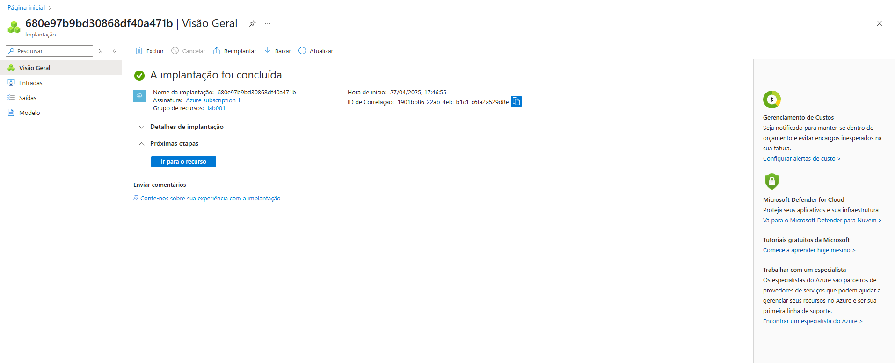
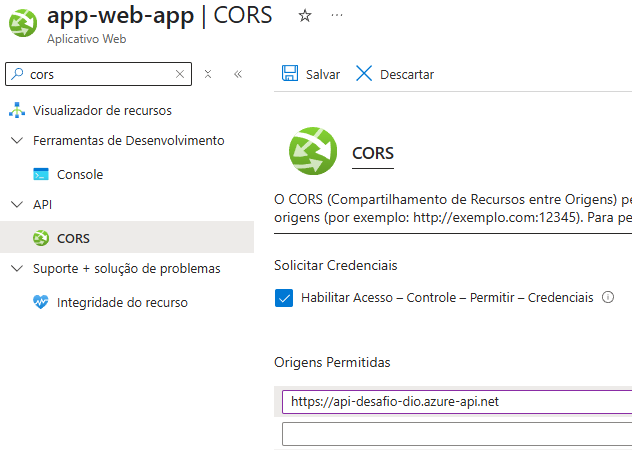
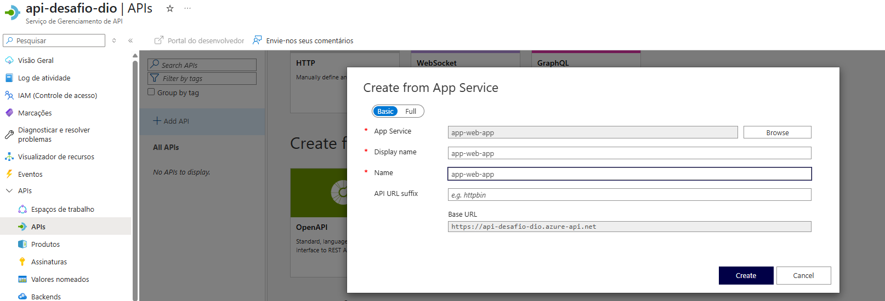
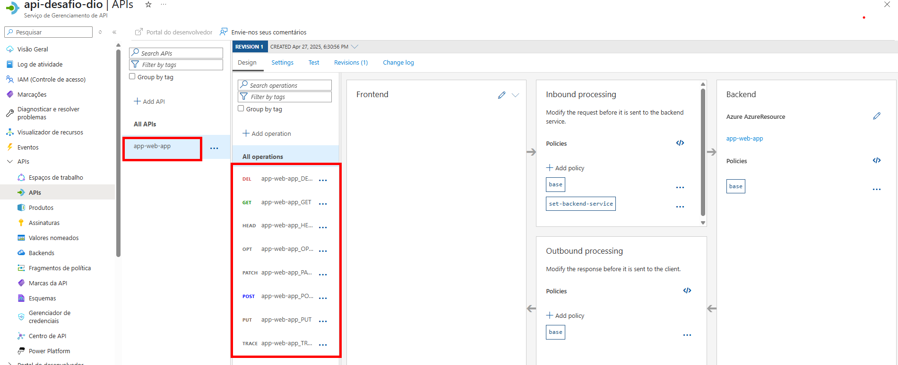

# Iniciando o projeto

Criação da API pelo recurso APImanegent do Azure.
Você deve nomear a API, nesse caso coloquei como <code>api-desafio-dio</code>
.
Além disso segui as configuraçãoes orientas pelo Henrique, para a definição da minha API. Finalizando as caracteristicas criamos a API e o Azure eva você a página onde mostra que a criação foi concluída. <i>(Figura Abaixo)</i>



Indo no recurso da API entramos na área de gerenciamento API. Precisamos ter um web-app criado no Azure para fazer a conexão com o API.

Com o aplicativo você precisa fazer a conexão com a AIP criada, na opção do CORS.



Feito isso podemos configurar nossa API no recruso da API Manegent.
Vamos na Opção de API e escolhemos a conexão com o app web, escolher mo app no browser e concluinos a conexão.



Nessa área você pode fazer o versionamento e os endpoints, mas escolhi não realizar essa etapa. Conclluido essa etapa o próprio recurso da APi cria os métodos HTTP da API.



Aqui podemos fazer os teste para a criação das respostas da API. Na opção do treinamento o MVP Henrique mostra boas práticas para a criação dos endpoints, mas não apliquei no repositório. Julguei não ser interessante aqui.

E para a finalização do desafio foi mostrado o processo de autenticação com JWT.

Na criação/adição de politicas adicionamos a validação JWT


Nessa etapa é bom esta definido os processos de chamadas e a documentação estrutural da API, para evitar retrabalho e conceder acesso de forma padrão e organizada.

```Lembrete
📋 Para que a validação ocorra, deve-se registrar o app
```

Depois de registart usa API está pronta para acesso.


