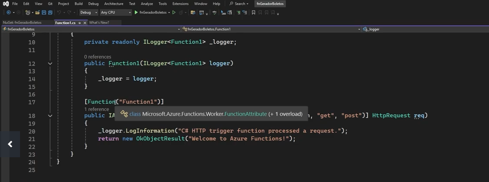

# Crianco um serviço Autenticador de Boletos

Cria primeiro o projeto no Visual Studio

Depois cria-se um Service bus no Azure. E faça as configurações conforme a sugestão do Henrique

Há todo uma regra montada no postman mas não irei postar. Depois da definição do Encode do código de Barras, é criado uma camada de UI.
