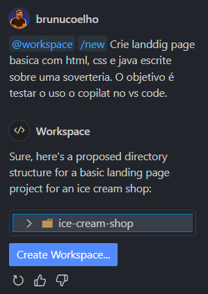
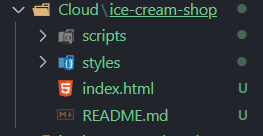
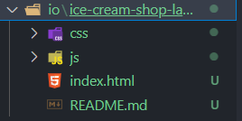
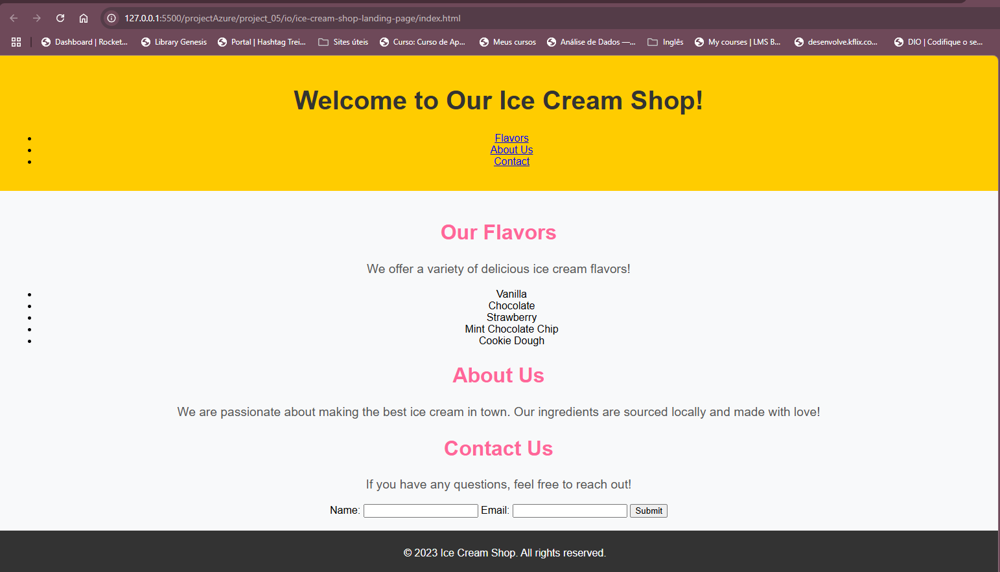

# Projeto 05 do Bootcamp Azure Native Cloud da Dio.me

O desafio era criar arquivo atráves do COPILOT no VS Code.

Depois de mandar o prompt no Copialt ele criou todo o projeto automaticamente. Solicitei no IA do gtp-4mini

Fiz a mesma coisa usando a IA o3. E criou uma página bem parecida.

Mudou algumas coisas na estrutura, mas a landing page foi bem parecida

Acima está o exemplo da landig page que a IA do copilot no VS criou rapidamente.