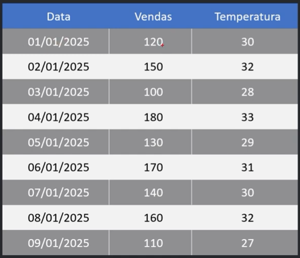
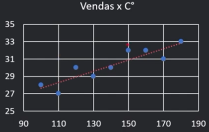
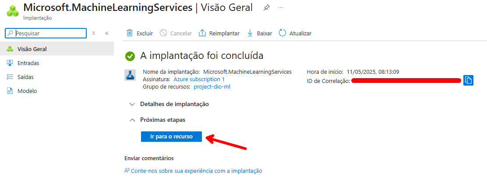
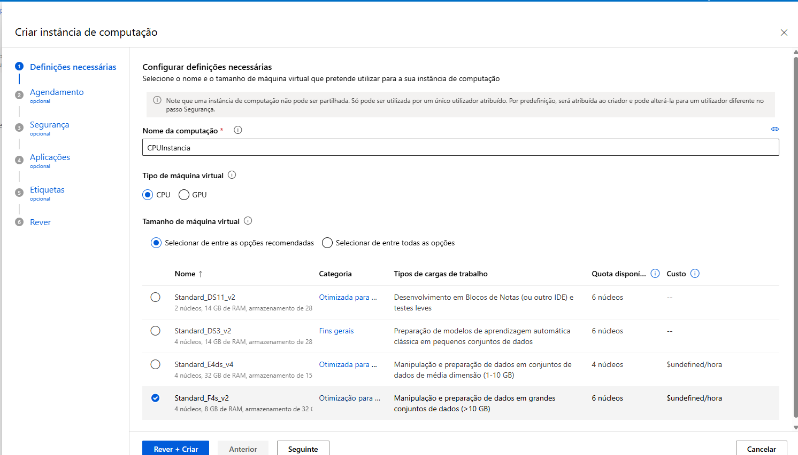
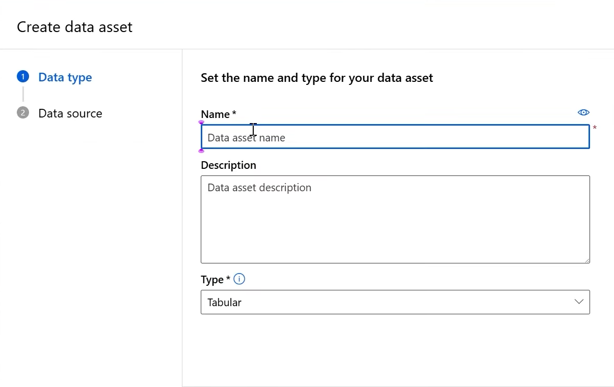
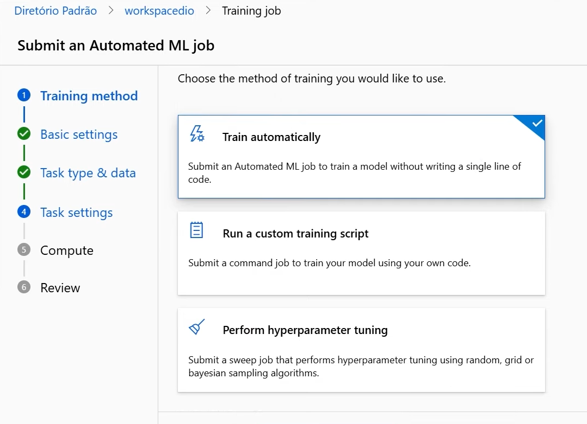
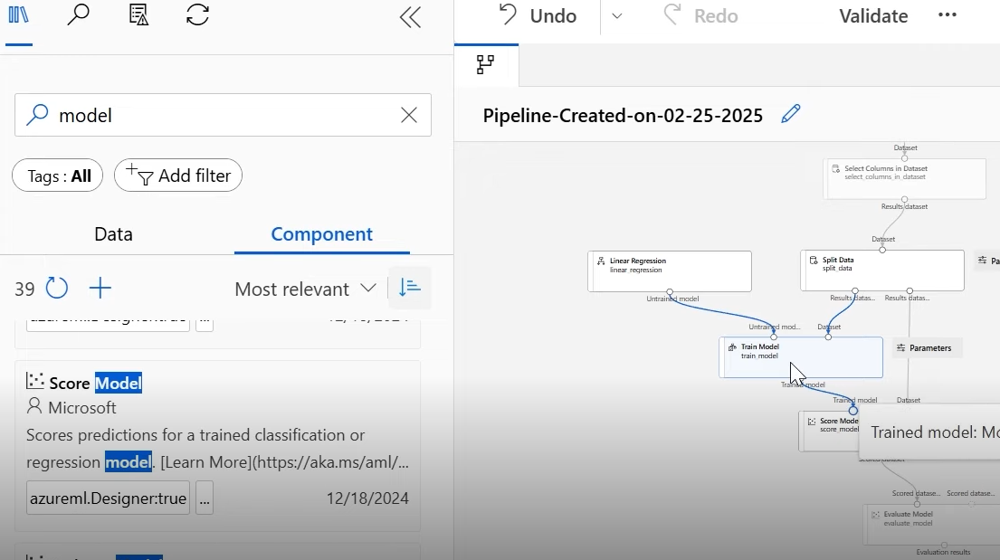

# Prevendo Vendas de Sorvete com Machine Learning 🍦📊

### Cenário
Imagine que você é proprietário de uma sorveteria chamada Gelato Mágico, localizada em uma cidade litorânea. Você percebe que a quantidade de sorvetes vendidos diariamente tem uma forte correlação com a temperatura ambiente. No entanto, sem um planejamento adequado, você pode acabar produzindo mais sorvetes do que o necessário e ter prejuízos com desperdícios ou, ao contrário, produzir menos e perder vendas.

Para solucionar esse problema, você decide usar Machine Learning para prever quantos sorvetes serão vendidos com base na temperatura. Com esse modelo, será possível antecipar a demanda e planejar a produção de maneira eficiente.

Agora é a sua hora de brilhar e construir um perfil de destaque na DIO! Explore todos os conceitos explorados até aqui e replique (ou melhore, porque não?) este projeto prático. Para isso, crie seu próprio repositório e aumente ainda mais seu portfólio de projetos no GitHub, o qual pode fazer toda diferença em suas entrevistas técnicas 😎

### Objetivo
O objetivo deste projeto é desenvolver um modelo de regressão preditiva que permita: 

✅ Treinar um modelo de Machine Learning para prever as vendas de sorvete com base na temperatura do dia.
✅ Registrar e gerenciar o modelo usando o MLflow.
✅ Implementar o modelo para previsões em tempo real em um ambiente de cloud computing.
✅ Criar um pipeline estruturado para treinar e testar o modelo, garantindo reprodutibilidade.

## 1. Base de dados

Temos a base de dados oferecida pelo curso.
```
import pandas as pd

# Criando o DataFrame com base na tabela da imagem
dados = {
    "Data": [
        "01/01/2025", "02/01/2025", "03/01/2025", "04/01/2025", 
        "05/01/2025", "06/01/2025", "07/01/2025", "08/01/2025", 
        "09/01/2025"
    ],
    "Vendas": [120, 150, 100, 180, 130, 170, 140, 160, 110],
    "Temperatura": [30, 32, 28, 33, 29, 31, 30, 32, 27]
}

df = pd.DataFrame(dados)
```




## 2. Criar os recursos no Azure

O primeiro passo é criar um grupo de recursos para que dentro dele criarmos o MLAzure. 

Assim que finalizado 



Acessando o Studio ML do Azure, criamos uma computação antes de criar o notebook.



Depois criamos um dataset



Após isso criamos um Automated ML



e um designer




