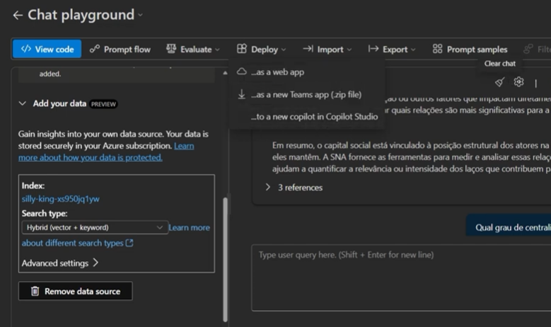

# Criando um Chatbot Baseado em Conteúdo de PDFs

## Visão Geral do Desafio

Neste desafio, você desenvolverá um chat interativo que responderá com base no conteúdo dos seus arquivos PDF. Para isso, utilizaremos conceitos de IA generativa, embeddings e buscas vetorizadas para estruturar um sistema capaz de entender, processar e responder perguntas a partir de documentos específicos. Essa abordagem permitirá que você crie um modelo personalizado de assistência virtual focado em um conjunto de informações proprietárias, sem depender unicamente do conhecimento geral de modelos pré-treinados.

### Cenário
Imagine que você é um estudante de Engenharia de Software, prestes a escrever seu Trabalho de Conclusão de Curso (TCC). Para isso, você precisa revisar e correlacionar diversos artigos científicos. Entretanto, à medida que acumula mais documentos, torna-se cada vez mais difícil extrair informações relevantes e conectar ideias entre diferentes textos.

Diante desse desafio, você decide utilizar inteligência artificial para facilitar esse processo, criando um sistema de busca inteligente capaz de interpretar os PDFs, organizar informações e gerar respostas relevantes com base no conteúdo carregado.

### Objetivo
O objetivo deste projeto é permitir que você:

✅ Carregue arquivos PDF contendo informações relevantes para seu estudo ou projeto.

✅ Implemente um sistema de busca vetorial para indexar e recuperar informações dos PDFs.

✅ Utilize inteligência artificial para gerar respostas baseadas no conteúdo dos documentos carregados.

✅ Desenvolva um chat interativo onde seja possível realizar perguntas e obter respostas contextuais fundamentadas nos arquivos

## 1. Preparar o amambiente no Azure Foundry

Ter os PDF's bases para utilizar como fonte.
Depois criar o prpjeto no Azure AI Foundry

E cria-se os 2 modelos bases, um gpt.4

Visão Geral do Desafio
Neste desafio, você desenvolverá um chat interativo que responderá com base no conteúdo dos seus arquivos PDF. Para isso, utilizaremos conceitos de IA generativa, embeddings e buscas vetorizadas para estruturar um sistema capaz de entender, processar e responder perguntas a partir de documentos específicos. Essa abordagem permitirá que você crie um modelo personalizado de assistência virtual focado em um conjunto de informações proprietárias, sem depender unicamente do conhecimento geral de modelos pré-treinados.

Cenário
Imagine que você é um estudante de Engenharia de Software, prestes a escrever seu Trabalho de Conclusão de Curso (TCC). Para isso, você precisa revisar e correlacionar diversos artigos científicos. Entretanto, à medida que acumula mais documentos, torna-se cada vez mais difícil extrair informações relevantes e conectar ideias entre diferentes textos.

Diante desse desafio, você decide utilizar inteligência artificial para facilitar esse processo, criando um sistema de busca inteligente capaz de interpretar os PDFs, organizar informações e gerar respostas relevantes com base no conteúdo carregado.

Objetivo
O objetivo deste projeto é permitir que você:

✅ Carregue arquivos PDF contendo informações relevantes para seu estudo ou projeto.

✅ Implemente um sistema de busca vetorial para indexar e recuperar informações dos PDFs.

✅ Utilize inteligência artificial para gerar respostas baseadas no conteúdo dos documentos carregados.

✅ Desenvolva um chat interativo onde seja possível realizar perguntas e obter respostas contextuais fundamentadas nos arquivos

### Criando os modelos

Criamos o modelo do gpt-4o e o text-embedding-3-large

DEpois de criado usamos o plaground para testar com perguntas baseadas no nossos arquivos. O PLaygrounds cria vetores que pegam as perguntas feitas e associam aos textos do chat.

### Teste do chat

